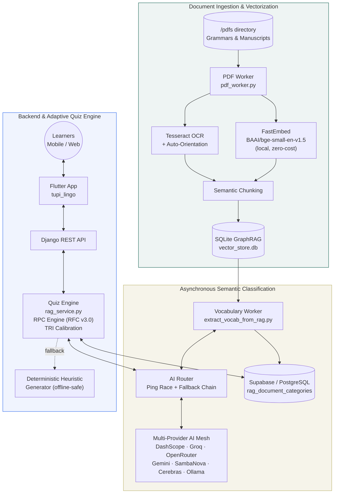
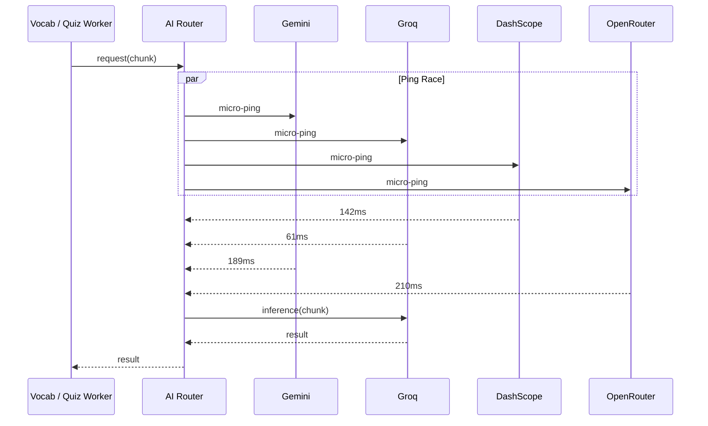
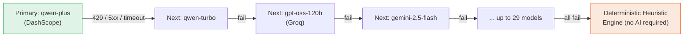
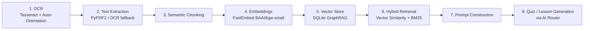
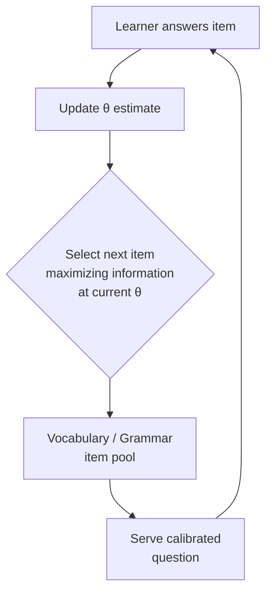
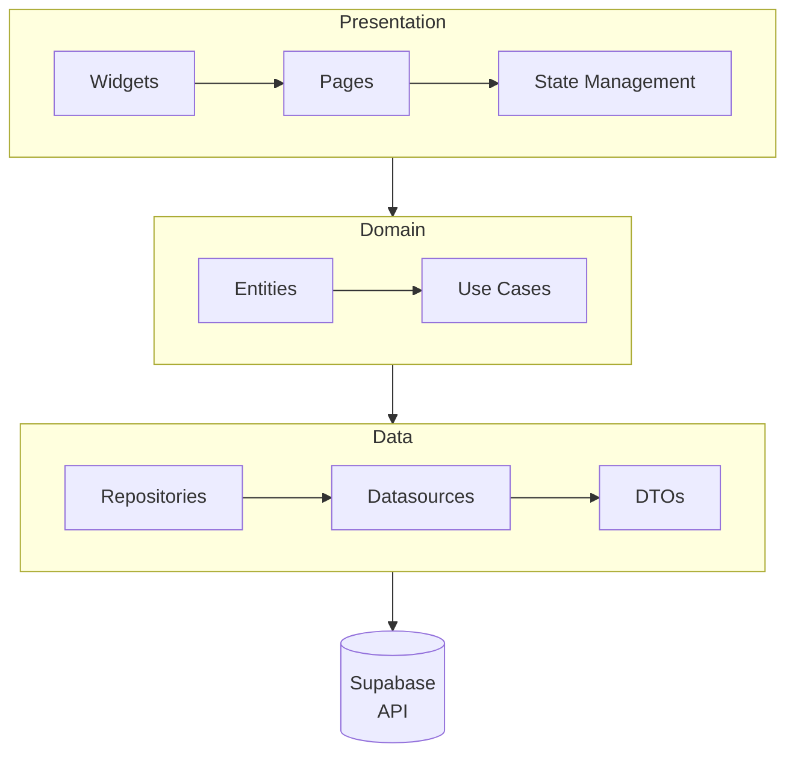
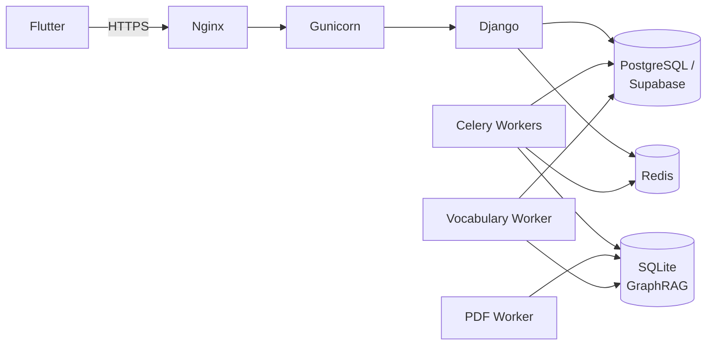
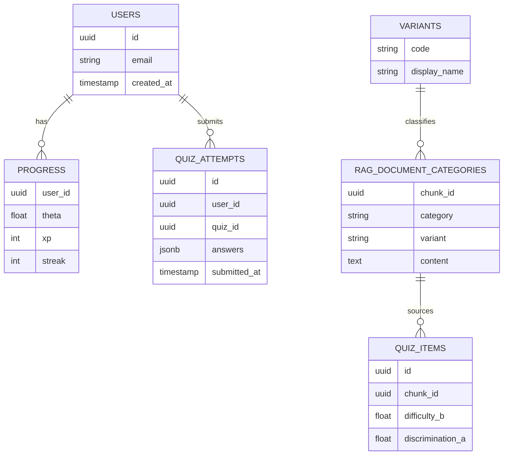
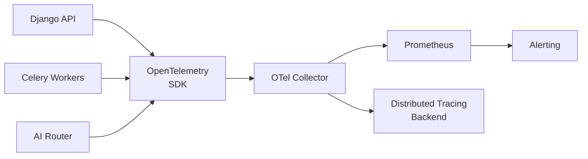
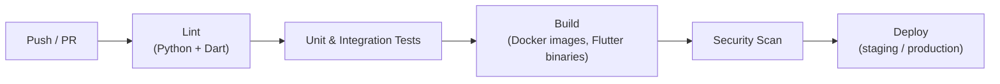

<div align="center">

<svg width="100%" height="220" viewBox="0 0 1200 220" xmlns="http://www.w3.org/2000/svg" role="img" aria-label="TupiLingo Banner">
  <defs>
    <linearGradient id="bgGrad" x1="0%" y1="0%" x2="100%" y2="100%">
      <stop offset="0%" stop-color="#0E5D4E"/>
      <stop offset="55%" stop-color="#14532D"/>
      <stop offset="100%" stop-color="#B8AF64"/>
    </linearGradient>
    <pattern id="dots" width="26" height="26" patternUnits="userSpaceOnUse">
      <circle cx="2" cy="2" r="1.4" fill="#F3F2E8" opacity="0.18"/>
    </pattern>
  </defs>
  <rect width="1200" height="220" rx="18" fill="url(#bgGrad)"/>
  <rect width="1200" height="220" rx="18" fill="url(#dots)"/>
  <g transform="translate(60,58)">
    <text x="0" y="0" font-family="Helvetica, Arial, sans-serif" font-size="56" font-weight="700" fill="#F3F2E8">TupiLingo</text>
    <text x="0" y="42" font-family="Helvetica, Arial, sans-serif" font-size="20" fill="#F3F2E8" opacity="0.92">Enterprise AI Platform for Indigenous Language Learning &amp; Revitalization</text>
    <text x="0" y="74" font-family="Helvetica, Arial, sans-serif" font-size="15" fill="#D08A45">Adaptive Learning · Retrieval-Augmented Generation · Multi-LLM Orchestration · Item Response Theory</text>
  </g>
  <g transform="translate(980,40)" opacity="0.9">
    <circle cx="0" cy="0" r="46" fill="none" stroke="#F3F2E8" stroke-width="2" opacity="0.5"/>
    <circle cx="0" cy="0" r="30" fill="none" stroke="#D08A45" stroke-width="2" opacity="0.8"/>
    <circle cx="0" cy="0" r="14" fill="#F3F2E8" opacity="0.9"/>
  </g>
</svg>

# TupiLingo

**Enterprise platform for the preservation, teaching, and revitalization of Tupi languages (Old Tupi, Tupinambá, and Contemporary Tupi), powered by adaptive AI, hybrid Retrieval-Augmented Generation, and multi-provider LLM orchestration.**

<br/>

[](#)
[](#)
[](#)
[](#)

[](#)
[](#)
[](#)

[](#)
[](#)
[](#)
[](#)
[](#)
[](#)

[](#)
[](#)
[](#)
[](#)
[](#)

[](#-license)
[](#)
[](#)
[](#)
[](#)

</div>

<br/>

<div align="center">
<sub>Built to preserve and democratize access to one of Brazil's most significant linguistic heritages — through software engineering, applied AI, and cultural stewardship.</sub>
</div>

<br/>

---

## Table of Contents

| # | Section |
|---|---|
| 01 | [Vision](#01--vision) |
| 02 | [Why TupiLingo?](#02--why-tupilingo) |
| 03 | [Platform Overview](#03--platform-overview) |
| 04 | [Complete Architecture](#04--complete-architecture) |
| 05 | [AI Infrastructure](#05--ai-infrastructure) |
| 06 | [Retrieval-Augmented Generation Pipeline](#06--retrieval-augmented-generation-pipeline) |
| 07 | [Adaptive Learning Engine (IRT / TRI)](#07--adaptive-learning-engine-irt--tri) |
| 08 | [Backend Architecture](#08--backend-architecture) |
| 09 | [Flutter Architecture](#09--flutter-architecture) |
| 10 | [Design System](#10--design-system) |
| 11 | [Learning Experience](#11--learning-experience) |
| 12 | [Repository Structure](#12--repository-structure) |
| 13 | [Development Environment](#13--development-environment) |
| 14 | [Docker Infrastructure](#14--docker-infrastructure) |
| 15 | [API Documentation](#15--api-documentation) |
| 16 | [Database Architecture](#16--database-architecture) |
| 17 | [Security](#17--security) |
| 18 | [Observability](#18--observability) |
| 19 | [Performance](#19--performance) |
| 20 | [Testing Strategy](#20--testing-strategy) |
| 21 | [CI/CD Pipeline](#21--cicd-pipeline) |
| 22 | [Contributing](#22--contributing) |
| 23 | [Roadmap](#23--roadmap) |
| 24 | [Documentation Index](#24--documentation-index) |
| 25 | [License](#25--license) |
| 26 | [Credits](#26--credits) |

---

## 01 · Vision

> **TupiLingo** exists at the intersection of three disciplines that rarely meet in production software: computational linguistics, distributed AI systems engineering, and cultural preservation.

### Mission
Preserve and democratize access to Tupi linguistic heritage — Old Tupi, Tupinambá, and Contemporary Tupi — through adaptive, AI-driven education that is resilient, low-cost to operate, and available even in low-connectivity environments.

### Vision
To become the leading open technological ecosystem dedicated to Brazilian indigenous languages, combining rigorous NLP engineering with community-driven cultural stewardship.

### Engineering Principles

| Principle | Description |
|---|---|
| **Resilience over elegance** | Every critical path (AI inference, quiz generation) has a deterministic fallback that does not depend on any external provider. |
| **Cost-aware by design** | Local embeddings (FastEmbed) and a 29-model fallback chain minimize cloud spend during heavy ingestion and inference workloads. |
| **Idempotent by default** | Workers write with `ON CONFLICT DO UPDATE` semantics and only commit local state after remote persistence succeeds. |
| **Observability first** | Every worker, router decision, and API call is designed to be traceable via OpenTelemetry and Prometheus. |
| **Offline-capable** | A local Ollama fallback and a heuristic quiz generator guarantee availability even with zero connectivity. |

### Educational Principles
- Adaptive difficulty calibrated per learner via Item Response Theory (IRT/TRI), not static curricula.
- Vocabulary, grammar, history, and mythology are treated as **first-class semantic categories**, not generic tags.
- Historical primary sources (colonial letters, travel accounts, grammars) are treated as living pedagogical material, not static archives.

### Cultural Preservation Principles
- Dialectal variants (Old Tupi, Tupinambá, Contemporary Tupi) are represented as distinct learning tracks, never collapsed into a single "generic Tupi."
- Mythology and cosmology (Tupã, Curupira, Anhangá) are preserved as cultural content, not merely translated vocabulary.
- Source material provenance is preserved through the RAG pipeline's category and chunk metadata.

---

## 02 · Why TupiLingo?

Most language-learning applications optimize for high-resource languages with abundant training data, native speakers, and commercial incentives. Tupi languages have none of these advantages at scale — which is precisely why the platform's engineering has to work harder.

TupiLingo addresses three structural problems:

1. **Scarcity of digitized material.** Grammars and manuscripts exist mostly as scanned colonial-era documents, requiring OCR-resilient ingestion rather than clean text imports.
2. **Absence of a large-scale training corpus.** Instead of fine-tuning a dedicated model (cost-prohibitive for a niche language), TupiLingo orchestrates general-purpose LLMs through RAG, grounding generation in verified source material.
3. **Fragile availability of AI infrastructure.** A single-provider dependency is unacceptable for an educational tool used daily; the platform therefore treats AI availability as a distributed-systems problem, not an API integration detail.

### TupiLingo vs. Traditional Language Apps

| Dimension | Traditional Apps (Duolingo-style) | TupiLingo |
|---|---|---|
| Content source | Human-authored curricula | RAG over primary historical & academic sources |
| Difficulty model | Fixed lesson trees | Item Response Theory (θ-based adaptive calibration) |
| AI dependency | None or single-vendor | 6 cloud providers + local Ollama, with automatic failover |
| Offline resilience | Limited or none | Deterministic heuristic quiz engine with 100% uptime guarantee |
| Target language resourcing | High-resource languages | Low-resource, endangered indigenous languages |
| Content categories | Generic vocabulary/grammar | Vocabulary, Grammar, History, Mythology, Unknown (semantic classification) |
| Cost model | Human content teams | Local embeddings + free-tier/low-cost LLM fallback chain |

---

## 03 · Platform Overview

TupiLingo is composed of five cooperating subsystems: a **document ingestion pipeline**, an **asynchronous semantic classification layer**, a **multi-provider AI mesh**, a **Django backend with an adaptive quiz engine**, and a **Flutter cross-platform client**.

### Layer Responsibilities

| Layer | Responsibility |
|---|---|
| **Flutter Client** (`tupi_lingo`) | Learning journey UI, authentication (OTP), lesson player, gamification, offline caching. |
| **Django API** | REST endpoints, business rules, RPC-based quiz engine, TRI calibration, rate limiting. |
| **AI Router** (LiteLLM-based) | Provider abstraction, ping-race latency routing, sequential fallback across 29 models. |
| **RAG Engine** | PDF/OCR ingestion, semantic chunking, FastEmbed embeddings, hybrid vector + BM25 retrieval. |
| **Supabase / PostgreSQL** | User data, learning progress, RAG document categories, authentication. |
| **SQLite (GraphRAG)** | Local, zero-cost vector store for ingested document chunks prior to classification. |
| **Redis + Celery** | Caching, async task queues, worker orchestration. |
| **Docker / Nginx / Gunicorn** | Containerized deployment, reverse proxying, WSGI serving in production. |

---

## 04 · Complete Architecture

The diagram below traces the full path of a document from ingestion to an adaptive quiz question served to a learner.



**End-to-end flow:**
1. Raw PDFs (grammars, colonial manuscripts, dictionaries) land in `/pdfs` and are picked up by the **PDF Worker**.
2. Text is extracted via `PyPDF2` for native PDFs, or via **Tesseract OCR** with auto-orientation detection for scanned material.
3. Extracted text is semantically chunked and embedded locally using **FastEmbed**, avoiding API costs during large ingestion batches (>1.2 GB).
4. Chunks and vectors are persisted to a local **SQLite GraphRAG** store (`vector_store.db`).
5. The **Vocabulary Worker** reads unclassified chunks (`category_extracted = 0`) and submits them to the AI Router for semantic classification.
6. The **AI Router** selects the lowest-latency available provider via ping-race, or fails over sequentially across up to 29 models if the primary fails.
7. Classified chunks are persisted idempotently to **Supabase/PostgreSQL** (`rag_document_categories`) via `ON CONFLICT (chunk_id) DO UPDATE`.
8. At quiz time, the **Quiz Engine** retrieves calibrated vocabulary/grammar items through Supabase RPCs, uses the AI Router only for pedagogical phrasing and distractor generation, and falls back to a **deterministic heuristic engine** if all LLM providers are unavailable.
9. The **Flutter client** renders the adaptive lesson and quiz experience to the learner.

---

## 05 · AI Infrastructure

### Multi-Provider AI Mesh

TupiLingo does not depend on a single LLM vendor. Instead, it operates a routing layer (built on `LiteLLM`) that abstracts six cloud providers plus a fully offline local option.

| Provider | Representative Models | Role in the System |
|---|---|---|
| **Alibaba Cloud (DashScope)** | `qwen-plus`, `qwen3.6-plus`, `qwen-turbo`, `qwen-max`, `qwen3.7-max`, `qwen3.8-max`, `qwen2.5-coder` | **Primary workhorse** for the vocabulary worker and the quiz generator. |
| **Groq Cloud (LPU)** | `openai/gpt-oss-120b`, `openai/gpt-oss-20b`, `qwen3.8-27b`, `allam-2-7b`, `compound` | Ultra-low-latency inference for chat and quiz support. |
| **OpenRouter (Free Tiers)** | `minimax-m2.7:free`, `gemma-4-31b-it:free`, `poolside/laguna-xs`, `north-mini-code` | Tertiary, zero-cost contingency layer. |
| **Google Gemini** | `gemini-2.5-flash` | Multimodal processing and general-purpose support. |
| **Cerebras & SambaNova** | `qwen-3.8-27b`, `DeepSeek-V3.2`, `Meta-Llama-3.3-70B-Instruct` | Hardware-accelerated failover for peak demand. |
| **Ollama (Local)** | `qwen2.5:1.5b`, `llama3.2:1b` | 100% offline inference for disconnected environments. |

> **Model segregation.** Moderation models (`meta-llama/llama-prompt-guard`), audio/speech models (`whisper-large-v3-turbo`, `canopylabs/orpheus-v1`), and embedding/reranker models are strictly isolated from the text-inference queue to avoid cross-contamination of the fallback chain.

### LiteLLM Router Architecture

The router (`router.py`) exposes a single call interface to the rest of the platform while internally managing provider selection, health state, and fallback ordering. Two cooperating strategies drive provider selection:

- **`ping_race.py`** — dispatches parallel micro-pings to all chain candidates and elects the lowest-latency provider available *at that moment*.
- **`fallback.py`** — on any failure (rate limit `429`, `402`, timeout, `5xx`, or malformed JSON), fails over **immediately** to the next model in the chain, with no exponential backoff delay.



### Failover Chain

If the elected provider fails mid-request, the router advances sequentially through the remaining models in the chain — up to **29 models** — for the same chunk, without discarding it.



### Retry Strategy

| Mechanism | Behavior |
|---|---|
| **Timeout** | Each provider call is bounded; unresponsive providers are cut short rather than blocking the chunk. |
| **Fail-fast** | No exponential backoff between chain hops — the router assumes provider failure is often persistent within a short window and moves on immediately. |
| **Sequential exhaustion** | A chunk is never discarded on a single-provider failure; it is retried across the full 29-model chain before falling back to the deterministic engine. |
| **Circuit breaking (implicit)** | Ping-race naturally deprioritizes consistently slow/unresponsive providers by never selecting them as the fastest candidate. |
| **Idempotent writes** | `Tenacity`-backed retries around persistence ensure a chunk's classification is committed exactly once via `ON CONFLICT DO UPDATE`. |

---

## 06 · Retrieval-Augmented Generation Pipeline



| Stage | Description |
|---|---|
| **OCR** | `Tesseract` with automatic page-orientation detection, used for scanned colonial manuscripts and legacy grammars. |
| **Text Extraction** | Native-text PDFs are parsed via `PyPDF2`; OCR is used as a resilient fallback path. |
| **Semantic Chunking** | Documents are split into semantically coherent chunks rather than fixed-size windows. |
| **Embedding** | Local, zero-cost embeddings via `FastEmbed` (`BAAI/bge-small-en-v1.5`), avoiding cloud embedding costs on large ingestion batches. |
| **Vector Store** | Chunks and vectors are stored in a local SQLite-based GraphRAG store before being classified and promoted to Supabase. |
| **Hybrid Retrieval** | Combines vector similarity search with `Rank BM25` lexical matching for more robust retrieval on short, terminology-dense Tupi text. |
| **Classification** | The Vocabulary Worker labels each chunk into one of five semantic categories: **Vocabulary**, **Grammar**, **History**, **Mythology**, or **Unknown**. |
| **Generation** | The AI Router is invoked only for pedagogical phrasing and distractor generation — factual content is grounded in retrieved chunks, not free generation. |

### Semantic Categories

| Category | Description |
|---|---|
| `Vocabulário` | Dictionaries, glossaries, and term-to-term translations. |
| `Gramática` | Syntactic rules, verb conjugation, affixes, and morphology. |
| `História` | Colonial letters, travel accounts (Hans Staden, Thevet), conflicts, and settlement records. |
| `Mitologia` | Legends, mythical entities (Tupã, Curupira, Anhangá), rituals, and cosmology. |
| `Desconhecido` | Strictly reserved for summaries, indexes, and content-free noise. |

---

## 07 · Adaptive Learning Engine (IRT / TRI)

TupiLingo calibrates question difficulty per learner using **Item Response Theory** (Teoria de Resposta ao Item), rather than a fixed lesson sequence.

### The 3-Parameter Logistic Model

$$P(\theta) = c + \frac{1 - c}{1 + e^{-a(\theta - b)}}$$

| Symbol | Meaning |
|---|---|
| $\theta$ | Learner's current estimated ability level. |
| $a$ | Item discrimination — how sharply the item separates learners of different ability. |
| $b$ | Item difficulty — the ability level at which a learner has a 50% (adjusted) chance of answering correctly. |
| $c$ | Guessing parameter — the floor probability of a correct answer regardless of ability. |

### How Calibration Drives Lesson Selection



- The engine selects, from the available vocabulary and grammar item pool, the question that provides **maximum information** at the learner's current ability estimate — neither trivially easy nor unreachably hard.
- **Distractors** (plausible wrong answers) are generated by the AI Router based on retrieved RAG context, keeping them linguistically and semantically plausible rather than random.
- If all cloud LLMs are simultaneously unavailable, a **deterministic heuristic generator** produces a valid lesson immediately without any external AI dependency — guaranteeing 100% availability of the core learning loop.

---

## 08 · Backend Architecture

The backend is a Django 5.1 project (Python 3.13+) exposing a REST API via Django REST Framework, with dedicated services for AI orchestration, RAG, and background workers.

```
backend/
├── app/                      # Core business rules & shared services
├── config/                   # Django settings (dev / production split)
├── docker/                   # Dockerfiles & container entrypoints
├── nivelamento/               # RAG engine & PDF processing module
├── trilha/                    # Learning-track module (journey, XP, streaks)
├── users/                     # User management, auth, OTP
├── router/                    # LiteLLM-based multi-provider AI router
├── workers/                   # PDF Worker, Vocabulary Worker (Celery tasks)
├── rag/                       # Chunking, retrieval, hybrid search
├── observability/             # OpenTelemetry & Prometheus instrumentation
└── manage.py
```

### Key Responsibilities

| Component | Responsibility |
|---|---|
| **Services** | Encapsulate business logic (e.g. `rag_service.py`, `achievement_service.py`) independent of HTTP concerns. |
| **RPC Engine (RFC v3.0)** | Queries vocabulary/grammar terms directly via Supabase RPC, minimizing LLM calls to only pedagogical phrasing and distractors. |
| **Authentication** | JWT-based sessions, integrated with Supabase Auth and OTP verification. |
| **Rate Limiting** | `django-ratelimit` protects API routes from abuse. |
| **Async Workers** | Celery tasks backed by Redis handle PDF ingestion and vocabulary classification without blocking API request cycles. |
| **AI Services** | Wrap the AI Router, exposing a single internal interface regardless of which provider ultimately serves the request. |

---

## 09 · Flutter Architecture

The mobile/web client (`frontend/tupi_lingo`) follows **Clean Architecture**, separating presentation concerns from business rules and data access.



```
frontend/tupi_lingo/lib/
├── core/            # Cross-cutting utilities, error handling, constants
├── features/         # Modular feature packages (auth, lessons, quiz, profile)
│   └── <feature>/
│       ├── presentation/
│       ├── domain/
│       └── data/
├── shared/           # Shared widgets and services
├── theme/            # Design tokens, colors, typography
└── routing/          # App navigation and route guards
```

- **State Management:** feature-scoped state, isolating UI rebuilds from network and business-logic changes.
- **Services:** thin wrappers over `supabase_flutter` and the Django REST API, exposed to the domain layer through repository interfaces.
- **Theme:** centralizes the design tokens described in [Section 10](#10--design-system), ensuring visual consistency across the app.
- **Feature Modules:** each learning capability (lessons, quizzes, achievements, profile) is isolated as an independently testable module.

---

## 10 · Design System

### Color Tokens

| Token | Value | Usage |
|---|---|---|
| Primary (Forest Green) | `#0E5D4E` | Primary actions, brand identity |
| Secondary (Moss Gold) | `#B8AF64` | Accents, achievements, highlights |
| Background (Warm Beige) | `#F3F2E8` | App background, cards |
| Accent (Earth Orange) | `#D08A45` | Calls to action, streak indicators |
| Neutral (Slate Gray) | `#475569` | Secondary text, borders |

### Typography, Spacing & Radius

| Token | Guideline |
|---|---|
| Typography | System-native fonts on each platform, with a consistent type scale across headings, body, and captions. |
| Spacing | 4px base unit grid for consistent padding/margin across widgets. |
| Radius | Rounded corners (12–20px) applied consistently to cards, buttons, and modals for a warm, approachable feel. |
| Icons | Consistent line-icon set across navigation and feature entry points. |

### Visual Philosophy
The palette intentionally evokes **forest, earth, and heritage** rather than a generic ed-tech aesthetic — reflecting the platform's dual identity as both a technology product and a cultural preservation effort.

---

## 11 · Learning Experience

| Feature | Description |
|---|---|
| **Journey Map** | Navigation across thematic modules and dialectal variants (Old Tupi, Tupinambá, Contemporary Tupi). |
| **Interactive Lesson Player** | Translation exercises, term identification, listening, and grammatical association activities. |
| **XP & Streaks** | Experience points and daily streak tracking via `achievement_service.py`. |
| **Achievements & Badges** | Milestone-based gamification tied to learning progress. |
| **Historical Lessons** | Content grounded in primary colonial-era sources, surfaced through the RAG pipeline's `História` category. |
| **Vocabulary & Grammar Modules** | Adaptive item pools calibrated via the TRI engine. |
| **Dialectal Variants** | Old Tupi, Tupinambá, and Contemporary Tupi presented as distinct, explicit learning tracks. |
| **Performance Reports** | Progress and mastery reporting per learner, derived from θ estimates over time. |

---

## 12 · Repository Structure

```
TupiLingo/
├── backend/
│   ├── app/
│   │   ├── models/
│   │   ├── serializers/
│   │   └── views/
│   ├── config/
│   │   ├── settings/
│   │   │   ├── base.py
│   │   │   ├── development.py
│   │   │   └── production.py
│   │   └── urls.py
│   ├── docker/
│   │   ├── Dockerfile
│   │   └── entrypoint.sh
│   ├── nivelamento/
│   │   ├── pdf_worker.py
│   │   └── extract_vocab_from_rag.py
│   ├── trilha/
│   ├── users/
│   ├── router/
│   │   ├── ping_race.py
│   │   └── fallback.py
│   ├── workers/
│   ├── observability/
│   └── manage.py
│
├── frontend/
│   └── tupi_lingo/
│       ├── lib/
│       │   ├── core/
│       │   ├── features/
│       │   ├── shared/
│       │   ├── theme/
│       │   └── routing/
│       ├── assets/
│       └── pubspec.yaml
│
├── docs/
│   ├── architecture/
│   ├── api/
│   ├── deployment/
│   ├── security/
│   ├── ai/
│   ├── frontend/
│   ├── backend/
│   └── assets/
│
├── scripts/
├── supabase/
├── docker-compose.yml
├── docker-compose.dev.yml
└── README.md
```

### Repository Map

| Directory | Responsibility |
|---|---|
| `backend/app` | Business rules, models, serializers, and API views. |
| `backend/workers` | PDF Worker and Vocabulary Worker task definitions. |
| `backend/nivelamento` | RAG ingestion and vocabulary extraction module. |
| `backend/router` | LiteLLM-based AI routing, ping-race and fallback logic. |
| `backend/config` | Environment-split Django settings. |
| `backend/observability` | OpenTelemetry and Prometheus instrumentation. |
| `frontend/lib/features` | Modular Flutter feature packages (Clean Architecture). |
| `docs/` | Architecture, API, deployment, security, and AI documentation. |
| `supabase/` | Supabase-specific configuration and RPC definitions. |

---

## 13 · Development Environment

### Requirements

| Tool | Version | Required |
|---|---|---|
| Flutter SDK | `^3.12.2` or later | ✅ |
| Python | `3.13+` | ✅ |
| Docker & Docker Compose | Latest stable | ⚙️ Recommended |
| Supabase account | — | ✅ |

### 1. Clone the Repository

```bash
git clone https://github.com/<your-org>/tupilingo.git
cd tupilingo
```

### 2. Backend Setup

```bash
cd backend
cp .env.example .env
# Fill in DASHSCOPE_API_KEY, GROQ_API_KEY, GEMINI_API_KEY, SUPABASE_URL, etc.
```

**Option A — Local Python:**

```bash
python3 -m venv venv
source venv/bin/activate        # Windows: venv\Scripts\activate

pip install -r requirements.txt
python manage.py migrate
python manage.py runserver
```

**Option B — Docker Compose:**

```bash
docker compose -f docker-compose.yml -f docker-compose.dev.yml up --build
```

The API becomes available at `http://localhost:8000`.

### 3. Frontend Setup

```bash
cd frontend/tupi_lingo
flutter pub get
# Configure frontend/tupi_lingo/.env with your Supabase keys
flutter run
```

### 4. Maintenance / ETL Scripts

```bash
# Continuous vocabulary extraction
docker exec backend-vocab_worker-1 python manage.py extract_vocab_from_rag --continuous

# Cleanup of corrupted chunks
docker exec backend-vocab_worker-1 python manage.py cleanup_corrupted_chunks
```

### Environment Variables

| Variable | Required | Description | Default | Environment |
|---|---|---|---|---|
| `DEBUG` | ⚙️ | Enables Django debug mode | `True` | Development |
| `PRODUCTION` | ⚙️ | Toggles production-hardened settings | `False` | Production |
| `SECRET_KEY` | ✅ | Django cryptographic signing key | — | All |
| `SUPABASE_URL` | ✅ | Supabase project endpoint | — | All |
| `SUPABASE_KEY` | ✅ | Supabase anon/service role key | — | All |
| `DATABASE_URL` | ✅ | PostgreSQL connection string | — | All |
| `GEMINI_API_KEY` | ⚙️ | Google Gemini access | — | AI Router |
| `DASHSCOPE_API_KEY` | ⚙️ | Alibaba DashScope (Qwen) access | — | AI Router |
| `GROQ_API_KEY` | ⚙️ | Groq Cloud access | — | AI Router |
| `OPENROUTER_API_KEY` | ⚙️ | OpenRouter free-tier access | — | AI Router |
| `CEREBRAS_API_KEY` | ⚙️ | Cerebras access | — | AI Router |
| `SAMBANOVA_API_KEY` | ⚙️ | SambaNova access | — | AI Router |
| `USE_SUPABASE_QUIZ_ENGINE` | ⚙️ | Enables the RPC Hybrid Quiz Engine (RFC v3.0) | `true` | Backend |
| `REDIS_URL` | ✅ | Redis connection string for cache/broker | — | All |

---

## 14 · Docker Infrastructure

| Service | Role |
|---|---|
| **Docker Compose** | Orchestrates all services for local and staging environments. |
| **Redis** | Cache layer and Celery message broker. |
| **Celery** | Executes asynchronous ETL and classification tasks. |
| **Nginx** | Reverse proxy in front of the Django/Gunicorn stack. |
| **Gunicorn** | Production WSGI server for the Django API. |



```bash
# Development stack
docker compose -f docker-compose.yml -f docker-compose.dev.yml up --build

# Production stack
docker compose -f docker-compose.yml up -d --build
```

---

## 15 · API Documentation

Endpoints are grouped by domain. All authenticated routes require a valid JWT bearer token issued via Supabase Auth.

### Authentication

| Method | Endpoint | Description |
|---|---|---|
| `POST` | `/api/auth/login` | Authenticate a user and issue a session token. |
| `POST` | `/api/auth/register` | Create a new user account. |
| `POST` | `/api/auth/otp/verify` | Verify a one-time password for identity confirmation. |
| `POST` | `/api/auth/password/reset` | Trigger the password-recovery flow. |

### Quiz & Adaptive Learning

| Method | Endpoint | Description |
|---|---|---|
| `POST` | `/api/quiz/generate` | Generate an adaptively calibrated quiz for the current learner. |
| `POST` | `/api/quiz/submit` | Submit answers and update the learner's θ estimate. |
| `GET` | `/api/quiz/history` | Retrieve past quiz attempts and scores. |

### Progress & Lessons

| Method | Endpoint | Description |
|---|---|---|
| `GET` | `/api/progress` | Retrieve the learner's overall progress, XP, and streaks. |
| `GET` | `/api/lessons` | List available lessons for the learner's current track. |
| `GET` | `/api/lessons/{id}` | Retrieve a specific lesson's content. |

### Variants & Content

| Method | Endpoint | Description |
|---|---|---|
| `GET` | `/api/variants` | List available dialectal variants (Old Tupi, Tupinambá, Contemporary Tupi). |
| `GET` | `/api/vocabulary` | Query classified vocabulary items. |

### Health & Workers

| Method | Endpoint | Description |
|---|---|---|
| `GET` | `/api/health` | Liveness/readiness probe for the API. |
| `GET` | `/api/workers/status` | Current status of PDF and vocabulary workers. |

### Example Payload — Quiz Generation

```json
{
  "user_id": "usr_2f9a1c",
  "variant": "tupinamba",
  "category": "vocabulario",
  "theta": 0.42
}
```

```json
{
  "quiz_id": "qz_88b1",
  "items": [
    {
      "term": "abá",
      "prompt": "What does 'abá' mean in Tupinambá?",
      "options": ["man", "water", "fire", "house"],
      "correct": "man",
      "difficulty_b": 0.35
    }
  ]
}
```

---

## 16 · Database Architecture

TupiLingo uses a three-tier persistence model, each tier chosen for a distinct latency/cost/durability tradeoff.

| Store | Purpose |
|---|---|
| **PostgreSQL (Supabase)** | Source of truth for users, progress, and classified RAG categories. |
| **SQLite (`vector_store.db`)** | Local, zero-cost GraphRAG store for pre-classification chunk staging. |
| **Redis** | Ephemeral cache and Celery broker; not a system of record. |



---

## 17 · Security

TupiLingo follows standard enterprise practices for authentication, secret management, and API hardening.

| Control | Implementation |
|---|---|
| **Authentication** | JWT-based sessions issued via Supabase Auth. |
| **Identity Verification** | OTP (One-Time Password) confirmation on registration and sensitive actions. |
| **Secrets Management** | All credentials injected via environment variables; never committed to source control. |
| **Docker Secrets** | Production deployments inject secrets at the container-runtime level, not baked into images. |
| **Rate Limiting** | `django-ratelimit` protects authentication and generation-heavy endpoints from abuse. |
| **CORS** | Explicit allow-list of trusted origins for cross-origin requests. |
| **CSRF Protection** | Enabled for all state-changing, cookie-authenticated endpoints. |
| **Input Validation** | Pydantic and DRF serializers validate all inbound payloads before reaching business logic. |
| **OWASP Alignment** | API design follows OWASP API Security Top 10 guidance for authentication, rate limiting, and injection prevention. |

> **Credential handling:** API keys for AI providers, Supabase, and the database are never logged, never exposed to the Flutter client, and are scoped exclusively to backend services.

---

## 18 · Observability



| System | Objective |
|---|---|
| **OpenTelemetry** | Distributed tracing across API requests, worker tasks, and AI Router calls. |
| **Prometheus** | Metrics collection: request latency, worker throughput, provider failover rate. |
| **Health Checks** | Liveness and readiness probes for the API and worker containers. |
| **Logging** | Structured logs for worker cycles, chunk classification outcomes, and router decisions. |
| **Alerting** | Threshold-based alerts on elevated failover rate or worker backlog. |

---

## 19 · Performance

| Metric | Target |
|---|---|
| Quiz generation latency | < 300 ms (RPC-hybrid path) |
| RAG retrieval latency | < 50 ms (local SQLite hybrid search) |
| AI Router failover recovery | < 150 ms per hop |
| PDF ingestion throughput | Batch-processed asynchronously, decoupled from user-facing latency |

**Techniques employed:**
- **Redis caching** for frequently accessed vocabulary and progress data.
- **Async workers** (Celery) decouple heavy ingestion/classification from the request-response cycle.
- **Ping-race latency routing** minimizes tail latency on AI-dependent endpoints.
- **Batch processing** for PDF ingestion and vocabulary extraction, avoiding synchronous blocking of the API.

---

## 20 · Testing Strategy

| Layer | Approach |
|---|---|
| **Unit Tests** | Backend services and Flutter domain logic tested in isolation. |
| **Integration Tests** | Django API endpoints tested against a test database and mocked AI Router. |
| **Widget Tests** | Flutter widget-level tests for lesson player, quiz UI, and journey map. |
| **Golden Tests** | Visual regression tests for key Flutter screens against the design system. |
| **API Tests** | Contract tests for REST endpoints, including error-path and rate-limit behavior. |
| **Worker Tests** | PDF Worker and Vocabulary Worker tested against fixture documents and simulated provider failures. |
| **Coverage** | Coverage tracked per module, with emphasis on the AI Router fallback chain and TRI calibration logic. |

---

## 21 · CI/CD Pipeline



```yaml
# Simplified CI reference
stages:
  - lint
  - test
  - build
  - security-scan
  - deploy

lint:
  script:
    - flutter analyze
    - ruff check backend/

test:
  script:
    - pytest backend/
    - flutter test

build:
  script:
    - docker build -f backend/docker/Dockerfile -t tupilingo-backend .
    - flutter build apk --release

deploy:
  script:
    - docker compose -f docker-compose.yml up -d --build
  when: manual
```

---

## 22 · Contributing

Contributions are welcome. TupiLingo follows a standard Git Flow model with Conventional Commits.

### Branching Model

| Branch | Usage |
|---|---|
| `main` | Production-ready code only. |
| `develop` | Integration branch for upcoming releases. |
| `feature/*` | New features, branched from `develop`. |
| `fix/*` | Bug fixes, branched from `develop` or `main` for hotfixes. |

### Conventional Commits

```
feat:     a new feature
fix:      a bug fix
docs:     documentation-only changes
refactor: code change that neither fixes a bug nor adds a feature
perf:     performance improvement
test:     adding or correcting tests
ci:       CI/CD configuration changes
```

### Contribution Workflow

```bash
git checkout -b feature/my-feature
git commit -m "feat: add adaptive distractor caching"
git push origin feature/my-feature
```

Then open a **Pull Request** against `develop`, following the repository's issue and PR templates.

### Code Review Expectations
- All PRs require at least one approving review before merge.
- CI (lint, tests, build) must pass before merge is enabled.
- Changes touching the AI Router fallback chain or the TRI calibration logic require an accompanying test.

---

## 23 · Roadmap

| Phase | Status |
|---|---|
| Adaptive TRI Engine | 🟢 Shipped |
| Historical Narrative Lessons | 🟢 Shipped |
| Hybrid RAG Retrieval (Vector + BM25) | 🟢 Shipped |
| Multi-Provider AI Mesh with Ping Race | 🟢 Shipped |
| Offline Learning Mode | 🟡 In Progress |
| Speech Recognition for Pronunciation | 🟡 In Progress |
| Community Content Contributions | 🔵 Planned |
| Teacher / Educator Dashboard | 🔵 Planned |
| Additional Dialectal Variants | 🔵 Planned |

---

## 24 · Documentation Index

Further documentation is organized under `docs/`:

```
docs/
├── architecture/     # System-level architecture decisions
├── api/              # Endpoint references and payload schemas
├── deployment/        # Docker, environment, and release procedures
├── security/          # Threat model and hardening guidelines
├── ai/                 # AI Router, RAG, and TRI internals
├── frontend/           # Flutter architecture and design system
├── backend/             # Django services and worker internals
└── assets/              # Diagrams and supporting media
```

---

## 25 · License

This project is licensed under the **MIT License**. See the [LICENSE](LICENSE) file for full terms.

---

## 26 · Credits

TupiLingo is built on the shoulders of academic and historical work on Tupi languages, including colonial-era travel accounts, missionary grammars, and contemporary linguistic scholarship. The platform aims to make this material accessible and pedagogically useful without diminishing its cultural and historical context.

<div align="center">

<br/>

<svg width="100%" height="90" viewBox="0 0 1200 90" xmlns="http://www.w3.org/2000/svg" role="img" aria-label="Footer divider">
  <rect width="1200" height="90" fill="none"/>
  <line x1="60" y1="45" x2="1140" y2="45" stroke="#B8AF64" stroke-width="1.5" stroke-dasharray="2 10" stroke-linecap="round"/>
  <circle cx="600" cy="45" r="6" fill="#0E5D4E"/>
</svg>

**Building technology to preserve one of Brazil's greatest linguistic heritages.**

*TupiLingo — Indigenous Language AI Platform*

</div>
