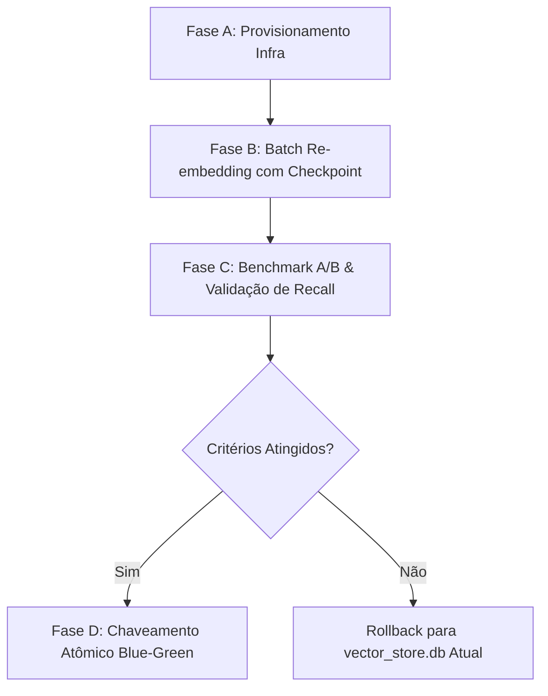

# Proposta Arquitetural: Migração de Modelo de Embeddings e Banco Vetorial

> **Status:** Proposta Documentada (NÃO Implementada nesta tarefa — RFC RFC-013)  
> **Data:** Setembro/2026  
> **Objetivo:** Estabelecer um plano estruturado e independente para a eventual evolução do modelo de embeddings e do armazenamento vetorial do TupiLingo, assegurando que o espaço vetorial de 22.140 chunks permaneça 100% íntegro e funcional durante o ciclo de melhoria de OCR.

---

## 1. Diagnóstico do Estado Atual

### 1.1 Modelo e Geometria Vetorial em Produção
* **Modelo Atual:** `sentence-transformers/all-MiniLM-L6-v2`
* **Dimensão do Espaço Vetorial:** $d = 384$ dimensões (float32).
* **Base de Dados Atual:** SQLite local (`backend/vector_store.db`), tabela `documents`.
* **Volume Indexado:** 22.140 chunks pós-remigração.
* **Mecanismo de Busca:** Cosine similarity em memória sobre vetores serializados em JSON / SQLite com pré-filtragem de categoria e deduplicação em tempo de consulta.

### 1.2 Por que a Migração de Embeddings NÃO Pode Ocorrer na Tarefa de OCR?
1. **Incompatibilidade Geométrica Inegociável:** Modelos de embeddings diferentes projetam textos em espaços latentes com topologias, dimensões e distribuições distintas. Um vetor de 384 dimensões do `all-MiniLM-L6-v2` não pode ser comparado por produto escalar nem por distância de cosseno com um vetor de 1024 dimensões do `BGE-M3` ou do `multilingual-e5-large`.
2. **Risco Crítico de Degradação Silenciosa do RAG:** Se novas páginas forem inseridas ou reprocessadas com um novo modelo de embeddings enquanto o restante do corpus permanece no modelo antigo, a busca por similaridade do RAG retornará resultados aleatórios ou enviesados exclusivamente para os chunks novos, quebrando as respostas pedagógicas e o quiz.
3. **Custo de Reprocessamento Global:** Re-embeddar 22.140 chunks exige computação dedicada (~30 a 60 minutos em GPU, ou ~4 a 6 horas em CPU), devendo ter seus próprios testes de estresse, checkpoints e plano de rollback isolados.

---

## 2. Análise Comparativa dos Modelos Candidatos

| Modelo | Dimensão ($d$) | Contexto Máximo | Multilíngue | Prós | Contras / Custo de Infraestrutura |
| :--- | :---: | :---: | :---: | :--- | :--- |
| **all-MiniLM-L6-v2** *(Atual)* | 384 | 512 tokens | Razoável (PT/EN) | Ultraleve, roda instantaneamente em CPU, pegada de memória desprezível (<150MB). | Sem tokenização nativa otimizada para línguas indígenas aglutinativas. |
| **BAAI/bge-m3** | 1024 | 8192 tokens | Excelente (100+ línguas) | Suporte híbrido (denso + esparso Lexical weights + multi-vector ColBERT). Ideal para termos raros Tupi. | Modelo pesado (~2.2 GB VRAM/RAM). Em CPU, latência de inferência é 6x maior que o MiniLM. |
| **intfloat/multilingual-e5-large** | 1024 | 512 tokens | Muito Alta | Excelente separação semântica em corpora multilíngues históricos. | Não suporta janelas longas (>512 tokens), exige GPU para latência sub-50ms. |
| **jinaai/jina-embeddings-v3** | 1024 (Matryoshka) | 8192 tokens | Alta | Adapters de tarefa configuráveis (`retrieval.passage`, `retrieval.query`), flexibilidade de truncamento de dimensão. | Requer dependências recentes de Transformers/PyTorch e chave API ou download de ~2.4GB. |

---

## 3. Arquitetura de Armazenamento Vetorial Destino

### 3.1 Proposta: PostgreSQL + pgvector (Supabase ou Self-Hosted)
* **Tabela Vetorial Alvo:**
```sql
CREATE EXTENSION IF NOT EXISTS vector;

CREATE TABLE documents_v2 (
    id VARCHAR(64) PRIMARY KEY,
    document TEXT NOT NULL,
    embedding vector(1024), -- dimensionado para BGE-M3 ou e5-large
    metadata JSONB NOT NULL,
    created_at TIMESTAMP WITH TIME ZONE DEFAULT CURRENT_TIMESTAMP,
    categoria VARCHAR(64),
    confianca REAL,
    precisa_revisao SMALLINT DEFAULT 0
);

-- Índice HNSW para busca vetorial aproximada de altíssima velocidade (<5ms)
CREATE INDEX idx_documents_v2_hnsw ON documents_v2 
USING hnsw (embedding vector_cosine_ops)
WITH (m = 16, ef_construction = 64);

-- Índice GIN sobre metadados para filtros híbridos rápidos
CREATE INDEX idx_documents_v2_meta ON documents_v2 USING gin (metadata);
```

---

## 4. Plano de Execução em 4 Fases (Para Implementação Futura)



### Fase A — Provisionamento da Infraestrutura (Sem impacto em produção)
1. Provisionar instância PostgreSQL com `pgvector` habilitado (via Supabase ou Docker Compose dedicado na Fase 3).
2. Criar tabela paralela `documents_v2` e configurar índices HNSW.
3. Manter o backend apontando 100% para o `vector_store.db` atual.

### Fase B — Pipeline de Re-embedding em Lote com Checkpoint
1. Desenvolver script de migração assíncrono: `migrate_embeddings_v2.py`.
2. Processar os 22.140 chunks em lotes de 128 (se GPU) ou 32 (se CPU) com salvamento determinístico de progresso (`migration_progress.json`).
3. Preservar rigorosamente os IDs originais, metadados de página, confiança de OCR e categorização pedagógica já validados.
4. Suportar retomada automática em caso de interrupção ou queda de energia.

### Fase C — Benchmark A/B e Validação Semântica
1. Criar suíte de testes de recuperação com 50 queries representativas do TupiLingo (vocabulário, gramática quinhentista, toponímia e antropologia).
2. Medir:
   * **Recall@5** e **MRR (Mean Reciprocal Rank)**.
   * Latência p50, p95 e p99 da consulta.
   * Consumo de memória e estabilidade.
3. Se o novo modelo não apresentar ganho estatisticamente significativo de Recall em termos indígenas ou se a latência em CPU inviabilizar o ambiente local, o processo é cancelado sem nenhum prejuízo ao acervo.

### Fase D — Chaveamento Atômico (Blue-Green Deployment)
1. Alterar a flag de configuração no `settings.py` (`VECTOR_STORE_BACKEND="supabase_pgvector"` e `EMBEDDING_MODEL_NAME="BAAI/bge-m3"`).
2. Atualizar o `rag_service.py` para usar o novo cliente vetorial.
3. Manter o arquivo `vector_store.db` em modo somente-leitura por 30 dias como contingência operacional antes de qualquer expurgo.

---

## 5. Estimativa de Viabilidade e Recursos

| Ambiente | Tempo Estimado (22.140 Chunks) | Consumo de RAM | Risco Operacional |
| :--- | :---: | :---: | :---: |
| **CPU Local (12 núcleos, 7.3 GB RAM)** | ~4h30 – 6h00 | 2.5 – 3.2 GB | Médio (requer execução noturna com lotes pequenos para evitar saturação) |
| **GPU Dedicada (Google Colab / Worker T4/A10)** | ~25 – 40 min | < 2.0 GB VRAM | Baixo (ideal para geração rápida dos vetores antes de subir ao banco) |

---

## 6. Conclusão e Recomendação
A substituição do modelo de embeddings e da infraestrutura de banco vetorial é uma evolução de alto valor estratégico para a compreensão semântica profunda de textos Tupi históricos, mas **deve permanecer rigorosamente dissociada** desta rodada de melhoria de OCR. A integridade matemática dos 22.140 chunks do acervo atual permanece protegida e intocada.
