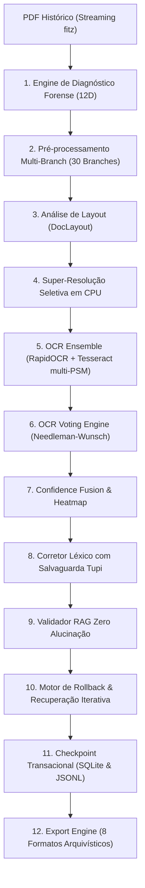
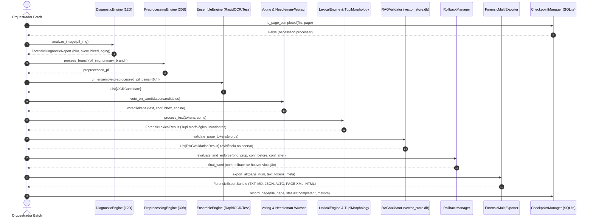

# Arquitetura Técnica — TupiLingo OCR Forense v3.0

## 1. Visão Geral da Arquitetura

O **TupiLingo OCR Forense v3.0** foi projetado com Clean Architecture e Domain Driven Design (DDD), organizado em 12 módulos independentes e desacoplados, voltados para a preservação arquivística e textual de documentos históricos em língua Tupi.



---

## 2. Diagrama Detalhado de Interação Entre Módulos



---

## 3. Composição da Confiança Multidimensional

A confiança de cada caractere e palavra é modelada como uma função convexa multidimensional:

$$C_{\text{final}} = w_{\text{ocr}} \cdot C_{\text{ocr}} + w_{\text{vis}} \cdot C_{\text{vis}} + w_{\text{lex}} \cdot C_{\text{lex}} + w_{\text{rag}} \cdot C_{\text{rag}}$$

Onde os pesos canônicos são parametrizados em:
- $w_{\text{ocr}} = 0.45$: Confiabilidade intrínseca das redes neurais do OCR (logits softmax das saídas CRNN/CTC).
- $w_{\text{vis}} = 0.20$: Nitidez visual avaliada pela variância Laplaciana e ausência de manchas de _bleed-through_.
- $w_{\text{lex}} = 0.20$: Validade morfológica e conformidade com os radicais do Tupi Antigo ou dicionário histórico.
- $w_{\text{rag}} = 0.15$: Densidade de evidência documental real nos 22.140 chunks do banco SQLite local.

---

## 4. Estrutura Modular dos Pacotes

```text
ocr_pipeline/
├── core/
│   ├── config.py                 # Pydantic v2 Settings globais e caminhos
│   ├── provenance.py             # Modelos de linhagem (BoundingBox, TokenProvenance)
│   ├── metrics.py                # Telemetria Windows API ctypes e Prometheus
│   ├── checkpoint_manager.py     # SQLite transacional e JSONL append-only
│   ├── scheduler.py              # Fatiamento em tiles com overlap
│   └── orchestrator.py           # Orquestrador Master end-to-end
│
├── diagnostic_engine/
│   └── forensic_analyzer.py      # 12 dimensões forenses pré-OCR
│
├── preprocessing_engine/
│   └── multi_branch.py           # 30 branches independentes de OpenCV/skimage
│
├── layout_engine/
│   └── doc_layout.py             # Segmentação semântica e ordem de leitura
│
├── super_resolution_engine/
│   └── tile_enhancer.py          # Super-resolução seletiva via Lanczos / ONNX INT8
│
├── ensemble_engine/
│   └── multi_engine.py           # RapidOCR ONNX + Tesseract multi-PSM
│
├── confidence_engine/
│   ├── token_voting.py           # Needleman-Wunsch e votação ponderada
│   └── confidence_fusion.py      # Fusão composta e heatmap visual RGBA
│
├── lexical_engine/
│   └── forensic_lexicon.py       # SymSpell adaptativo e parser morfológico Tupi
│
├── rag_validation_engine/
│   └── rag_validator.py          # Consulta contra vector_store.db local
│
├── rollback_engine/
│   └── rollback_manager.py       # Rollback Gate e recuperação iterativa (< 90%)
│
├── export_engine/
│   └── multi_exporter.py         # 8 formatos arquivísticos
│
├── benchmarking/
│   └── benchmark_v3.py           # Comparador quantitativo Legacy vs Forense v3
│
├── tests/                        # 12 suítes de testes unitários e de integração
└── docs/                         # Documentação técnica e ADRs
```
